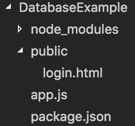

# 데이터베이스 사용하기
## MongoDB
### MongoDB란?
- 비관계형 데이터베이스  
- NoSQL(Not Only SQL)시스템이라고 함

**NoSQL 시스템이 SQL문을 사용하는 관계형 데이터베이스보다 더 주목받는 이유**  
관계형 데이터베이스는 시스템의 신뢰도를 높이는 데 필요한 장치를 많이 가지고 있다.  
또 SQL문을 읽어 들이고 실행하는 데 많은 리소스를 사용하며 이 때문에 성능이 떨어지는 경우가 많다.  
NoSQL은 성능을 최우선으로 생각하기 때문에 실시간으로 처리해야 하는 경우나 대용량 트래픽을 감당할 수 있는 메시징 시스템 등에 활용된다.  
특히 클라우스 서비스로 서버를 구성하는 경우가 많아지면서 많은 사용자를 수용하거나 시스템 자원을 적게 소모하는 **NoSQL 데이터베이스**에 점점 더 관심을 갖게 되었다.  
  
### MongoDB의 특징
몽고디비는 NoSQL이기 때문에 관계형 데이터베이스의 테이블 개념이 없다.  
그 대신 여러 데이터가 모인 하나의 단위를 **컬렉션(Collection)**이라고 부른다.  
관계형 데이터베이스의 테이블이 몽고디비의 컬렉션과 같다고 생각할 수도 있지만 컬렉션에서는 테이블과 달리 데이터를 정해 놓은 칼럼의 형태대로 컬렉션에 넣어야 한다는 제약이 없다.  
몽고디비는 데이터 저장소를 가지고 있으며 그 안에 여러 개의 컬렉션을 넣을 수 있다. 즉 데이터이스는 **컬렉션의 집합**이라고 할 수 있다. 그리고 각각의 컬렉션은 여러 개의 **문서 객체(Document)**를 가질 수 있다.  
문서 객체는 속성들의 집합으로서 한 사람의 이름과 나이 등을 저장하고 싶을 때 하나의 문서 객체를 만든 후 그 안에 자바스크립트 객체와 같이 속성들을 추가하여 저장할 수 있다.  
  
### MongoDB 설치
다음 링크를 참고  
[MongoDB Install](http://lab4109.tumblr.com/post/49883198513/mac-osx에-mongodb-설치-실행)  

- - -

## Express에서 MongoDB 사용하기
### MongoDB 모듈을 이용해 로그인 기능 만들기

**디렉토리 구조**  


**사전작업 : html 페이지 준비**  
public 디렉토리를 생성하고 그 안에 **login.html**작성  

```
<!DOCTYPE html>
<html>
    <head>
        <meta charset = "UTF-8">
        <title>로그인 테스트</title>
    </head>
    <body>
        <h1>로그인</h1>
        <br>
        <form method="post" action="/process/login">
            <table>
                <tr>
                    <td><label>아이디</label></td>
                    <td><input type="text" name="id"></td>
                </tr>
                <tr>
                    <td><label>비밀번호</label></td>
                    <td><input type="password" name="password"></td>
                </tr>
            </table>
            <input type="submit" value="전송" name="">
        </form>
</html>
```

**사전작업 : 모듈 설치**
```
npm install express --save
npm install http --save
npm install path --save
npm install body-parser --save
npm install cookie-parser --save
npm install serve-static --save
npm install errorhandler --save
npm install express-error-handler --save
npm install express-session --save
npm install mongodb --save
```

1. **MongoDB collection 추가**  
**CMD1**  
```
mongod
```
**CMD2**  
```
mongo

use local

db.users.insert({id:'yunth1228',name:'Terry',password:'123'});

// 데이터베이스 조회
db.users.find({});

// 데이터베이스 조회 - 예쁘게 출력
db.users.find({}).pretty();

```
2. **예제 코드 : app.js(이해 못하면 익스프레스서버.md 정독)**  
```
// Express Basic modules
var http= require('http');
var express = require('express');
var path = require('path');

// Express Middlewares
var bodyParser = require('body-parser');
var cookieParser = require('cookie-parser');
var static = require('serve-static');
var errorHandler = require('errorhandler');

// Error Handler Moudle
var expressErrorHandler = require('express-error-handler');


// Session Middleware
var expressSession = require('express-session');


// Express Instance
var app = express();
app.set('port',process.env.PORT || 8080);

app.use(bodyParser.urlencoded({extended:false}));
app.use(bodyParser.json());

app.use('/public',static(path.join(__dirname, 'public')));

app.use(cookieParser());

app.use(expressSession({
    secret : 'my key',
    resave : true,
    saveUninitialized: true
}));

// Use MongoDB Module
var MongoClient = require('mongodb').MongoClient;

// Database instance variable
var database;

// Connect to database
function connectDB(){
    // Database connection info
    var databaseUrl = 'mongodb://localhost:27017/local';

    // Connection
    MongoClient.connect(databaseUrl, function(err, db){
        if(err){
            console.log(err);
            throw err;
        } 

        console.log('Database Connection Succeed, '+databaseUrl);

        // Variable assignment
        database = db;
    });
}

app.post('/process/login', function(req,res){
    var paramId = req.param('id');
    var paramPassword = req.param('password');
    
    if(database){
        authUser(database, paramId, paramPassword, function(err, docs){
            
            // error : database connecting fail
            if(err) throw err;

            
            // No error, user exist::
            if(docs){
                console.log('Seached :: \n');
                console.dir(docs);
                res.writeHead('200',{'Content-Type' : 'text/html;charset=utf8'});
                res.write("<h1>Login succeed</h1>");
                res.write("<div><p>User Id : "+paramId+"</p></div>");
                res.write("<div><p>User Name : "+docs[0].name+"</p></div>");
                res.write("<br><br><a href='/public/login.html'>Go login</a>");
                res.end();
            }

            // No error, user doesn't exist::
            else{
                res.writeHead('200',{'Content-Type' : 'text/html;charset=utf8'});
                res.write('<h1>Login failed</h1>');
                res.write('<div><p>Please check your id, password</p></div>');
                res.write("<br><br><a href='/public/login.html'>Go login</a>");
                res.end();
            }
        });
    }
});

var authUser = function(database, id, password, callback){
    console.log("Function called 'authUser'");

    // Refer to users collection
    var users = database.collection('users');
    
    // Search with id, password
    users.find({"id":id, "password":password}).toArray(function(err, docs){
        // If error occured => Call function 'callback'
        if(err){
            
            // Error
            callback(err, null);
            return;
        }
        console.log("row : "+docs.length);
        // Error didn't occur, and searching succeed
        if(docs.length > 0){
            console.log("아이디 [%s], 비밀번호 [%s]가 일치하는 사용자 찾음",id, password);
            
            // No error, user exist
            callback(null, docs);
        }
        else{
            console.log('User searching failed');

            // No error, user doesn't exist
            callback(null, null);
        }
    });
}

// Server RUN :: 
http.createServer(app).listen(app.get('port'), function(){
    console.log('server opened on '+app.get('port')+' port');
    
    // Database Connection
    connectDB();

});
```

### 사용자 추가 기능 만들기
**사전 작업**  
**public폴더 안에 adduser.html 작성**  
```
<!Doctype html>
<html>
    <head>
        <meta charser="UTF-8">
        <title>User Adding Test</title>
    </head>
    <body>
        <h1>User Adding</h1>
        <br>
        <form method="post" action="/process/adduser">
            <table>
                <tr>
                    <td><label>ID</label></td>
                    <td><input type="text" name="id"></td>
                </tr>
                <tr>
                    <td><label>Password</label></td>
                    <td><input type="password" name="password"></td>
                </tr>
                <tr>
                    <td><label>Name</label></td>
                    <td><input type="text" name="name"></td>
                </tr>
            </table>
            <input type="submit" value="Submit" name="">
        </form>
        <br><br><a href='/public/login.html'>Go login</a>
    </body>
</html>
```
1. **위 app.js 파일 코드에 addUser 함수 추가**  
```
...


// User Adding
var addUser = function(database, id, password, name, callback){
    console.log("Function called 'addUser'");

    // Refer to users collection
    var users = database.collection('users');

    // Add account with id, password, username
    users.insertMany([{"id":id, "password":password, "name":name}], function(err, result){
        if(err){ // if the error occured, call the callback function(err)
            callback(err,null);
            return;
        }

        // if not, call the callback function(result)
        if(result.insertedCount > 0 ){
            console.log("inserted : "+result.insertedCount);
        }
        else{
            console.log("any record wasn't inserted");
        }

        callback(null, result);

    });
};

...

```

2. **Router를 이용해 /process/adduser으로 들어오는 post방식 요청 핸들, 등록**  
```
...

var router = express.Router();
router.route('/process/adduser').post(function(req, res){
    console.log("Called '/process/adduser'");

    var paramId = req.body.id || req.query.id;
    var paramPassword = req.body.password || req.query.password;
    var paramName = req.body.name || req.query.name;

    // if database exists, call 'addUser' function
    if(database){
        addUser(database, paramId, paramPassword, paramName, function(err, result){
            if(err) throw err;

            // if something inserted
            if(result && result.insertedCount > 0 ){
                console.dir(result);

                res.writeHead('200',{"Content-Type" : "text/html;charset=utf8"});
                res.write("<h2>User Adding Succeed</h2>");
                res.write("<br><br><a href='/public/login.html'>Go login</a>");
                res.end();
            }
            else{
                res.writeHead('200',{"Content-Type" : "text/html;charset=utf8"});
                res.write("<h2>User Adding Failed</h2>");
                res.write("<br><br><a href='/public/login.html'>Go login</a>");
                res.end();
            }
        });
    }
    else{
        res.writeHead('200',{"Content-Type" : "text/html;charset=utf8"});
        res.write("<h2>Database Connecting Failed</h2>");
        res.write("<br><br><a href='/public/login.html'>Go login</a>");
        res.end();
    }
});
app.use('/',router);

...
```