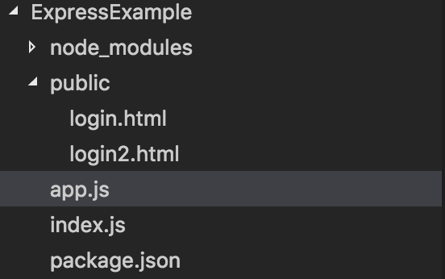
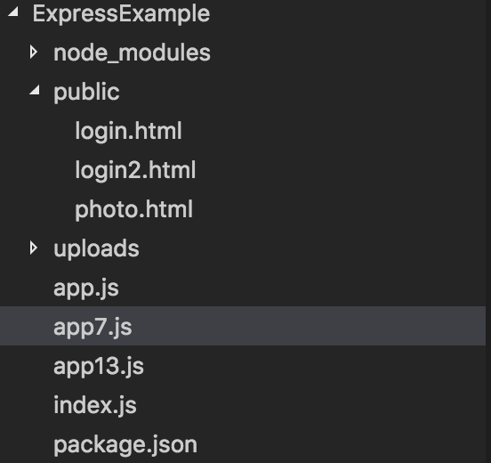

# 익스프레스?
간단한 코드로 웹 서버의 기능을 구현할 수 있도록 만들어진 모듈이다.  
express 모듈을 사용하면 간단한 코드로 웹 서버의 기능을 구현할 수 있고 특히 익스프레스에서 제공하는 **미들웨어**와 **라우터**를 사용하면 각각의 기능을 훨씬 편리하게 구현할 수 있다.  

## 새로운 익스프레스 서버 만들기
express 모듈은 웹 서버를 위해 만들어진 것이라 http 모듈 위에서 동작하기 때문에  
**express 모듈을 사용할 때에는 항상 http 모듈도 함께 불러들여야 한다**.  

### 익스프레스 서버를 만드는 방법
1. express 모듈 설치 
```
// console 창에서 npm 명령어 사용
npm install express --save
```

2. Express 기본 모듈 불러오기
```
// Express 기본 모듈 불러오기
var express = require('express');
var http = require('http'); // express 모듈은 http 모듈 위에서 동작함!  
```

3. 익스프레스 객체 생성  
express() 함수를 호출해 반환된 객체를 app 변수에 지정  
```
// 익스프레스 객체 생성
var app = express();
```

4. 기본 포트를 app 객체에 속성으로 설정  
set()메소드를 이용해 process.env 객체에 PORT 속성이 있으면 그 속성값을 port 번호로, 없다면 8000을 port 번호로 지정  
```
// 기본 포트를 app 객체에 속성으로 설정
app.set('port', process.env.PORT || 8000);
```

5. Express 서버 시작  
createServer() 메소드의 파라미터로 app을 넣어줌, 또한 listen() 메소드의 파라미터로 들어가는 port값을 get()메소드를 통해 가져옴  
```
// Express 서버 시작
http.createServer(app).listen(app.get('port'), function(){
    console.log('익스프레스 서버를 시작했습니다. : ' + app.get('port'));
});
```

6. 종합
```
// Express 기본 모듈 불러오기
var express = require('express');
var http = require('http');

// 익스프레스 객체 생성
var app = express();

// 기본 포트를 app 객체에 속성으로 설정
app.set('port', process.env.PORT || 8000);

// Express 서버 시작
http.createServer(app).listen(app.get('port'), function(){
    console.log('익스프레스 서버를 시작했습니다. : ' + app.get('port'));
});
```

**express() 메소드 호출로 만들어지는 익스프레스 서버 객체 (위 예제에서의 app)의 주요 메소드**

메소드 이름 | 설명
---|---
set(name, value) | 서버 설정을 위한 속성을 지정, set() 메소드로 지정한 속성은 get()메소드로 꺼내어 확인할 수 있음
get(name) | 서버 설정을 위해 지정한 속성을 꺼내 옴
use([path,] function[,function...]) | 미들웨어 함수를 사용
get([path,] function) | 특정 패스로 요청된 정보를 처리

set() 메소드는 웹 서버의 환경을 설정하는 데 필요한 메소드이다. 만약 title 속성을 app 객체에 넣어 두었다가 필요할 때 꺼내어 사용하고 싶다면 app.set('title', 'My App')처럼 set() 메소드를 호출하여 넣어 둘 수 있다.  
그런데 만약 set() 메소드로 설정한 속성의 이름이 미리 정해진 이름이라면 웹 서버의 환경 설정에 영향을 미친다.  
**서버 설정을 위해 미리 정해진 주요 속성의 이름은 다음과 같다.**  

속성 이름 | 설명
---|---
env | 서버 모드를 설정
views | 뷰들이 들어 있는 폴더 또는 폴더 배열을 설정
view engine | 디폴트로 사용할 뷰 엔진을 설정

**위 예제에서는 서버를 만들어 시작하긴 했지만 요청에 대해 어떤 응답을 할지 지정하지 않았기 때문에 브라우저로 접속해도 아무런 반응이 없을 것이다!**

## 미들웨어로 클라이언트에 응답 보내기
앞서 작성한 예제는 서버 구동 후 브라우저로 접속해도 아무런 반응이 없을 것이다.  
그 이유는 어떤 응답을 할 것인지 정하지 않았기 때문이다. 이는 간단한 웹 서버 만들기의 http서버 예제에 이벤트 등록이 빠진 것과 같다.  
그렇기 때문에 '미들웨어'라는것을 사용해 클라이언트에 응답을 보낸다.  

### 익스프레스에서 미들웨어를 사용하는 방식
클라이언트의 요청이 들어오면 express객체에 등록해 둔 미들웨어들이 실행된다. 각각의 미들웨어는 동작을 수행한 후 next() 메소드를 통해 다음 미들웨어로 순서를 넘긴다.  
**익스프레스에서 미들웨어를 사용하는 방식**  


### 미들웨어 예제
1. 단일 미들웨어 예제
```
var express = require('express');
var http = require('http');

var app = express();

app.use(function(req, res, next){
    console.log('첫 번째 미들웨어에서 요청을 처리함.');

    res.writeHead('200', {'Content-Type' : 'text/html;charset=utf8'});
    res.end('<h1>Express 서버에서 응답한 결과입니다.</h1>');
});

http.createServer(app).listen(8000, function(){
    console.log('Express 서버가 8000번 포트에서 시작됨.');
});
```

2. 다중 미들웨어 예제
```
var express = require('express');
var http = require('http');

var app = express();

// middleware #0
app.use(function(req, res, next){ 
    console.log('첫 번째 미들웨어에서 요청을 처리함.');

    req.user = 'Terry Yun'; // request 객체에 속성 추가
    next();
});

// middleware #1
app.use('/', function(req, res, next){
    console.log('두 번째 미들웨어에서 요청을 처리함.');

    res.writeHead('200', {'Content-Type' : 'text/html;charset=utf8'});
    res.end('<h1>Express 서버에서 '+req.user+'가 응답한 결과입니다.</h1>'); // middleware #0에서 request 객체에 추가한 속성인 user을 가져옴
});

http.createServer(app).listen(8000, function(){
    console.log('Express 서버가 8000번 포트에서 시작됨.');
});
```

## 익스프레스의 요청 객체와 응답 객체 알아보기
**익스프레스에서 사용하는 요청 객체와 응답 객체는 http 모듈에서 사용하는 객체들과 같다. 하지만 몇 가지 메소드를 더 추가할 수 있다.**  

### 추가로 사용할 수 있는 메소드

메소드 이름 | 설명
---|---
send([body]) | 클라이언트에 응답 데이터를 보낸다. 전달할 수 있는 데이터는 HTML 문자열, Buffer 객체, JSON 객체, JSON 배열이다.
status(code) | HTTP 상태 코드를 반환한다. 상태 코드는 end()나 send() 같은 전송 메소드를 추가로 호출해야 전송할 수 있다.
sendStatus(statusCode) | HTTP 상태 코드를 반환한다. 상태 코드는 상태 메시지와 함께 전송된다.
redirect([status,] path) | 웹 페이지 경로를 강제로 이동시킨다.
render(view [,locals][, callback]) | 뷰 엔진을 사용해 문서를 만든 후 전송한다.


## 익스프레스에서 요청 객체에 추가한 헤더와 파라미터 알아보기

### 익스프레스에서 추가로 사용할 수 있는 요청 객체의 속성들

추가한 정보 | 설명
---|---
query | 클라이언트에서 GET 방식으로 전송한 요청 파라미터를 확인한다.  ex) req.query.name
body | 클라이언트에서 POST 방식으로 전송한 요청 파라미터를 확인한다. 단, body-parser와 같은 외장 모듈을 사용해야 한다.  ex) req.body.name
header(name) | 헤더를 확인한다.

클라이언트에서는 요청 파라미터를 함께 보낼 수 있다. 이때 GET 방식으로 요청했다면 요청 파라미터는 요청 객체의 query안에 들어가고 POST 방식으로 요청했다면 요청 파라미터는 요청 객체의 body 안에 들어가게 된다.  


## 미들웨어 사용하기
npm을 이용해 미들웨어를 설치해서 사용할 수 있다. 방식은 모듈을 설치해 불러들이는 방식과 동일하다.

### static 미들웨어
1. 설명 : 특정 폴더의 파일들을 특정 패스로 접근할 수 있도록 만들어 줌  
2. 설치 방법
```
npm install serve-static --save
```
3. 사용 방법  
현재 디렉토리 구조가 다음과 같다고 하자.  
  
이 상태에서 public 폴더 안의 파일들을 웹 서버의 루트 패스로 접근할 수 있도록 만들고 싶다면 다음 코드를 추가하면 된다.  
```
var static = require('serve-static');

var express = require('express');
var http = require('http');

var app = express();

// static middleware
app.use(static(path.join(__dirname, 'public')));

// middleware #0
app.use(function(req, res, next){ 
    console.log('첫 번째 미들웨어에서 요청을 처리함.');

    req.user = 'Terry Yun'; // request 객체에 속성 추가
    next();
});

// middleware #1
app.use('/', function(req, res, next){
    console.log('두 번째 미들웨어에서 요청을 처리함.');

    res.writeHead('200', {'Content-Type' : 'text/html;charset=utf8'});
    res.end('<h1>Express 서버에서 '+req.user+'가 응답한 결과입니다.</h1>'); // middleware #0에서 request 객체에 추가한 속성인 user을 가져옴
});

http.createServer(app).listen(8000, function(){
    console.log('Express 서버가 8000번 포트에서 시작됨.');
});

```

### body-parser 미들웨어
1. 설명 : 클라이언트가 POST 방식으로 요청할 때 본문 영역에 들어 있는 요청 파라미터들을 파싱해 **요청 객체(req)**의 **body 속성**에 넣어준다.
2. 설치 방법  
```
npm install body-parser --save
```
3. 사용 방법  
디렉토리 구조가 다음과 같다고 할 때  
  
**login.html**  
```
<!DOCTYPE html>
<html>
    <head>
        <meta charset = "UTF-8">
        <title>로그인 테스트</title>
    </head>
    <body>
        <h1>로그인</h1>
        <br>
        <form method="post">
            <table>
                <tr>
                    <td><label>아이디</label></td>
                    <td><input type="text" name="id"></td>
                </tr>
                <tr>
                    <td><label>비밀번호</label></td>
                    <td><input type="password" name="pw"></td>
                </tr>
            </table>
            <input type="submit" value="전송" name="">
        </form>
</html>
```
**app7.js**  
```
// Express 기본 모듈 불러오기
var express = require('express');
var http  = require('http');
var path = require('path');

// Express의 미들웨어 불러오기
var bodyParser = require('body-parser');
var static = require('serve-static');

// Express 객체 생성
var app = express();

// 기본 속성 설정
app.set('port',process.env.PORT || 8080);

// body-parser를 사용해 application/x-www-form-unlencoded 파싱
app.use(bodyParser.urlencoded({extended : false}));

// body-parser를 사용해 application/json 파싱
app.use(bodyParser.json());

app.use(static(path.join(__dirname, 'public')));


// 미들웨어에서 파라미터 확인
app.use(function(req,res,next){
    console.log('첫 번째 미들웨어에서 요청을 처리함');

    var paramId = req.body.id || req.query.id;
    var paramPassword = req.body.pw || req.query.pw;

    res.writeHead('200',{'Content-Type' : 'text/html;charset=utf8'});
    res.write('<h1>Express 서버에서 응답한 결과입니다. </h1>');
    res.write('<div><p>Param id : '+ paramId + '</p></div>');
    res.write('<div><p>Param password : '+paramPassword+ '</p></div>');
    res.end();
});


// Express 서버 시작 
http.createServer(app).listen(app.get('port'), function(){
    console.log('익스프레스 서버를 시작했습니다. ' + app.get('port'));
});
```
## 요청 라우팅하기
### 라우터 미들웨어란?
미들웨어는 어떤 요청이 들어와도 미들웨어 함수가 실행되기 때문에 요청 url이 무엇인지 일일히 확인해야 하는 번거로움이 생긴다. 이를 해결한 것이 **라우터 미들웨어(router middleware)**이다.  
### 라우터 미들웨어 사용하기
라우터 미들웨어는 익스프레스에 포함되어 있다.  
사용자가 요청한 기능이 무엇인지 패스를 통해 구분한다.  
라우터 미들웨어는 익스프레스 객체에서 라우터 객체를 참조해 사용하고 라우팅 함수를 등록할 때에는 app객체에 설정을 한다.  
**라우터 사용**
```
// 라우터 객체 참조
var router = express.Router();

// 라우팅 함수 등록
router.route('/process/login').get{...};
router.route('/process/login').post{...};
...

// 라우터 객체를 app 객체에 등록
app.use('/', router);
```
위 코드에서 패스가 같고 메소드가 다른 두 코드를 작성한 이유는 클라이언트(사용자) 측에서 GET 방식으로 요청을 보낼지 POST 방식으로 요청을 보낼지 모르기 때문이다.  
route() 메소드로 요청 패스를 지정하고 그 뒤에 get(), post() 등 메소드를 이용해 실행될 함수를 등록할 수 있다.  
요청 패스를 라우터 객체에 등록할 때 사용하는 메소드는 다음과 같다.  
**라우터 메소드**  

메소드 이름 | 설명
---|---
get(callback) | GET 방식으로 특정 패스 요청이 발생했을 때 사용할 콜백 함수를 지정
post(callback) | POST 방식으로 특정 패스 요청이 발생했을 때 사용할 콜백 함수를 지정
put(callback) | PUT 방식으로 특정 패스 요청이 발생했을 때 사용할 콜백 함수를 지정
delete(callback) | DELETE 방식으로 특정 패스 요청이 발생했을 때 사용할 콜백 함수를 지정
all(callback) | 모든 요청 방식을 처리, 특정 패스 요청이 발생했을 때 사용할 콜백 함수를 지정


