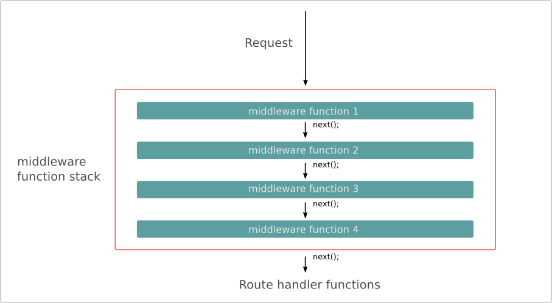

#익스프레스?
간단한 코드로 웹 서버의 기능을 구현할 수 있도록 만들어진 모듈이다.  
express 모듈을 사용하면 간단한 코드로 웹 서버의 기능을 구현할 수 있고 특히 익스프레스에서 제공하는 **미들웨어**와 **라우터**를 사용하면 각각의 기능을 훨씬 편리하게 구현할 수 있다.  

##새로운 익스프레스 서버 만들기
express 모듈은 웹 서버를 위해 만들어진 것이라 http 모듈 위에서 동작하기 때문에 **express 모듈을 사용할 때에는 항상 http 모듈도 함께 불러들여야 한다**.  

###익스프레스 서버를 만드는 방법
0. express 모듈 설치 
```
// console 창에서 npm 명령어 사용
npm install express --save
```

1. Express 기본 모듈 불러오기
```
// Express 기본 모듈 불러오기
var express = require('express');
var http = require('http'); // express 모듈은 http 모듈 위에서 동작함!  
```

2. 익스프레스 객체 생성
```
// 익스프레스 객체 생성
var app = express();
```
express() 함수를 호출해 반환된 객체를 app 변수에 지정  

3. 기본 포트를 app 객체에 속성으로 설정
```
// 기본 포트를 app 객체에 속성으로 설정
app.set('port', process.env.PORT || 8000);
```
set()메소드를 이용해 process.env 객체에 PORT 속성이 있으면 그 속성값을 port 번호로, 없다면 8000을 port 번호로 지정  

4. Express 서버 시작
```
// Express 서버 시작
http.createServer(app).listen(app.get('port'), function(){
    console.log('익스프레스 서버를 시작했습니다. : ' + app.get('port'));
});
```
createServer() 메소드의 파라미터로 app을 넣어줌, 또한 listen() 메소드의 파라미터로 들어가는 port값을 get()메소드를 통해 가져옴  

5. 종합
```
// Express 기본 모듈 불러오기
var express = require('express');
var http = require('http');

// 익스프레스 객체 생성
var app = express();

// 기본 포트를 app 객체에 속성으로 설정
app.set('port', process.env.PORT || 8000);

// Express 서버 시작
http.createServer(app).listen(app.get('port'), function(){
    console.log('익스프레스 서버를 시작했습니다. : ' + app.get('port'));
});
```

**express() 메소드 호출로 만들어지는 익스프레스 서버 객체 (위 예제에서의 app)의 주요 메소드**

메소드 이름 | 설명
---|---
set(name, value) | 서버 설정을 위한 속성을 지정, set() 메소드로 지정한 속성은 get()메소드로 꺼내어 확인할 수 있음
get(name) | 서버 설정을 위해 지정한 속성을 꺼내 옴
use([path,] function[,function...]) | 미들웨어 함수를 사용
get([path,] function) | 특정 패스로 요청된 정보를 처리

set() 메소드는 웹 서버의 환경을 설정하는 데 필요한 메소드이다. 만약 title 속성을 app 객체에 넣어 두었다가 필요할 때 꺼내어 사용하고 싶다면 app.set('title', 'My App')처럼 set() 메소드를 호출하여 넣어 둘 수 있다. 그런데 만약 set() 메소드로 설정한 속성의 이름이 미리 정해진 이름이라면 웹 서버의 환경 설정에 영향을 미친다.  
**서버 설정을 위해 미리 정해진 주요 속성의 이름은 다음과 같다.**  

속성 이름 | 설명
---|---
env | 서버 모드를 설정
views | 뷰들이 들어 있는 폴더 또는 폴더 배열을 설정
view engine | 디폴트로 사용할 뷰 엔진을 설정

**위 예제에서는 서버를 만들어 시작하긴 했지만 요청에 대해 어떤 응답을 할지 지정하지 않았기 때문에 브라우저로 접속해도 아무런 반응이 없을 것이다!**

## 미들웨어로 클라이언트에 응답 보내기
앞서 작성한 예제는 서버 구동 후 브라우저로 접속해도 아무런 반응이 없을 것이다.  
그 이유는 어떤 응답을 할 것인지 정하지 않았기 때문이다. 이는 간단한 웹 서버 만들기의 http서버 예제에 이벤트 등록이 빠진 것과 같다.  
그렇기 때문에 '미들웨어'라는것을 사용해 클라이언트에 응답을 보낸다.  

### 익스프레스에서 미들웨어를 사용하는 방식
클라이언트의 요청이 들어오면 express객체에 등록해 둔 미들웨어들이 실행된다. 각각의 미들웨어는 동작을 수행한 후 next() 메소드를 통해 다음 미들웨어로 순서를 넘긴다.  
**익스프레스에서 미들웨어를 사용하는 방식**  


### 미들웨어 예제
1. 단일 미들웨어 예제
```
var express = require('express');
var http = require('http');

var app = express();

app.use(function(req, res, next){
    console.log('첫 번째 미들웨어에서 요청을 처리함.');

    res.writeHead('200', {'Content-Type' : 'text/html;charset=utf8'});
    res.end('<h1>Express 서버에서 응답한 결과입니다.</h1>');
});

http.createServer(app).listen(8000, function(){
    console.log('Express 서버가 8000번 포트에서 시작됨.');
});
```

2. 다중 미들웨어 예제
```
var express = require('express');
var http = require('http');

var app = express();

// middleware #0
app.use(function(req, res, next){ 
    console.log('첫 번째 미들웨어에서 요청을 처리함.');

    req.user = 'Terry Yun'; // request 객체에 속성 추가
    next();
});

// middleware #1
app.use('/', function(req, res, next){
    console.log('두 번째 미들웨어에서 요청을 처리함.');

    res.writeHead('200', {'Content-Type' : 'text/html;charset=utf8'});
    res.end('<h1>Express 서버에서 '+req.user+'가 응답한 결과입니다.</h1>'); // middleware #0에서 request 객체에 추가한 속성인 user을 가져옴
});

http.createServer(app).listen(8000, function(){
    console.log('Express 서버가 8000번 포트에서 시작됨.');
});
```

## 익스프레스의 요청 객체와 응답 객체 알아보기
익스프레스에서 사용하는 요청 객체와 응답 객체는 http 모듈에서 사용하는 객체들과 같다. 하지만 **몇 가지 메소드를 더 추가할 수 있다.**

### 추가로 사용할 수 있는 메소드

메소드 이름 | 설명
send([body]) | 클라이언트에 응답 데이터를 보낸다. 전달할 수 있는 데이터는 HTML 문자열, Buffer 객체, JSON 객체, JSON 배열이다.
status(code) | HTTP 상태 코드를 반환한다. 상태 코드는 end()나 send() 같은 전송 메소드를 추가로 호출해야 전송할 수 있다.
sendStatus(statusCode) | HTTP 상태 코드를 반환한다. 상태 코드는 상태 메시지와 함께 전송된다.
redirect([status,] path) | 웹 페이지 경로를 강제로 이동시킨다.
render(view [,locals][, callback]) | 뷰 엔진을 사용해 문서를 만든 후 전송한다.